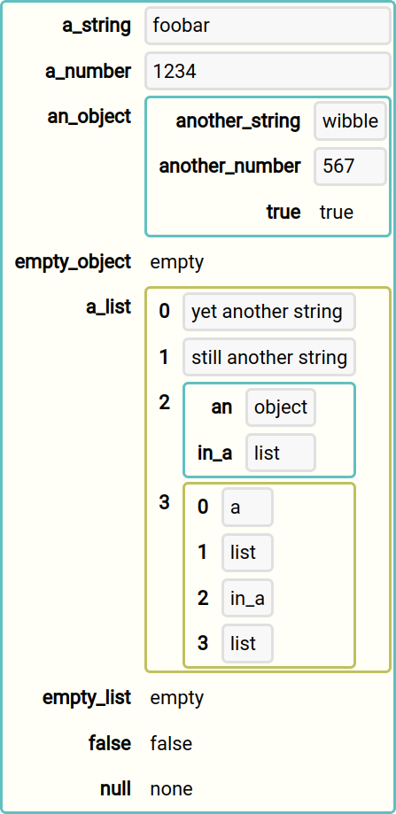

# JSON object React component (react-json-object)

[](https://github.com/mwri/react-json-object/actions/workflows/test.yml)

Objective: Make a react component for that gnarly lump of JSON.
Problem: Can't be bothered, it's not super important.
But: <pre>{JSON.stringify(data, null, 4)}</pre> lowers the tone so much.

Solution: <Json data={data} />

You cannot expect it to look amazing obviously, all it can do is recurse your data and
do the best it can based on it's typing.

## Quick start

```jsx
import Json from 'react-json-object';

function MyComponent ({ data }) {
    return (<Json data={data} />);
}
```

## What to expect

The out of the box result, with the default CSS, is OK, if obviously highly generic, and
it provides a DOM structure with a plentiful selection of classes, so you can probably
quite easily tweak it to suit your particular presentation neuroses in no time at all.

If you want more, well, there are a bunch of features that let you go from there to
being really unrecognisable from something you wrote entirely custom from scratch, but
if you find yourself getting too far with all that you should stop to ask if you shouldn't
actually do that instead; write your own components from scratch, because let's face
it, turning some static data into a React component render is pretty easy...

However, the advanced customisation features, useful if you have a known schema, include
path derived classes, so you can tweak the CSS of particular values without affecting
others, and you can also change the React component used to render particular types
or particular values (again by specified path), see details later.

You can also change what is shown for booleans and nulls instead of the default text, so
you can make booleans "on" and "off" instead of "true" and "false" for example.

## Default styling

Out of the box with the default CSS, the following data:

```json
{
    "a_string": "foobar",
    "a_number": 1234,
    "an_object": {
        "another_string": "wibble",
        "another_number": 567,
        "true": true
    },
    "empty_object": {},
    "a_list": [
        "yet another string",
        "still another string",
        {
            "an": "object",
            "in_a": "list"
        },
        [
            "a",
            "list",
            "in_a",
            "list"
        ]
    ],
    "empty_list": [],
    "false": false,
    "null": null
}
```

Is rendered like this:



Note that you can expect all values (containers and scalars) to be rendered the the
width required of by the widest peer, so they line up. This is clearly shown above.
This is entirely consistent, but in some respects looks inconsistent, since some values
are rendered to the full width of the container and some are not. Some simple CSS
options suggested below can make all values full width, or all minimum width, though
none of them will affect the top level object, the size of which is your responsibility
and you should take whatever steps are appropriate to make it's size behaviour to
your liking according to the other elements in play.

## CSS tweaks

If you don't want the list numbering (it doesn't technically add much in most scenarios)
then you can hide it with:

```css
.rjo-array-index {
    display: none;
}
```

Less useful, but, you can do the same with object keys:

```css
.rjo-object-key {
    display: none;
}
```

Minimising the width of values (obejcts, arrays, scalars) can be achieved with:

```css
.rjo-container-value {
    display: inline-block;
}
```

Maximising them (so their boundaries reach the ends of their container elements)
can be achieved with:

```css
.rjo-container-value {
    width: 100%;
}
```

These effects and more may be applied in various combination to other classes, see
below for a full list

## DOM scheme

The general DOM structure is like this (this is for illustration only, there are
other elements in between, and obviously all combinations are not shown):

```html
<element class="rjo-json">
    <element class="rjo-json-container rjo-json-object">
        <element class="rjo-container-value rjo-object-value">
            <element class="rjo-json">
                <element class="rjo-json-value rjo-json-scalar rjo-json-string" />
            </element>
        </element>

        <element class="rjo-container-value rjo-object-value">
            <element class="rjo-json">
                <element class="rjo-json-value rjo-json-scalar rjo-json-number" />
            </element>
        </element>
    </element>

    <element class="rjo-json-container rjo-json-array">
        <element class="rjo-container-value rjo-array-value">
            <element class="rjo-json">
                <element class="rjo-json-value rjo-json-scalar rjo-json-boolean" />
            </element>
        </element>

        <element class="rjo-container-value rjo-array-value">
            <element class="rjo-json">
                <element class="rjo-json-value rjo-json-scalar rjo-json-null" />
            </element>
        </element>
    </element>
</element>
```

Here `rjo-json` is applied to an element enclosing every JSON value (first the top level
value you provide, and again recursively for every string, number, boolean, null and sub
objects and arrays). Each child of a `rjo-json` will be an element with one of these
classes:

| Class            | Description                              |
|------------------|------------------------------------------|
| rjo-json-object  | An object, with named keys and values    |
| rjo-json-array   | A list/array, with just (ordered) values |
| rjo-json-null    | A null value                             |
| rjo-json-number  | A number                                 |
| rjo-json-boolean | A boolean                                |

The `rjo-json-object` and `rjo-json-array` elements will also have a `rjo-json-container`
class, and the others will have a `rjo-json-scalar` class. The scalars will also all
have a `rjo-json-value` class except for `rjo-json-null`, since this is really not a
value.

The first give lines show the nature of the recursion and repeat of the `rjo-json` element:

```html
<element class="rjo-json">
    <element class="rjo-json-container rjo-json-object">
        <element class="rjo-container-value rjo-object-value">
            <element class="rjo-json">
                <element class="rjo-json-value rjo-json-scalar rjo-json-string" />
```

The `rjo-json` element contains an object, which obviously has a set of sub values, and
for each there will be a container element with `rjo-container-value rjo-object-value`
classes, which will contain another `rjo-json` element. A string is used here but of course
it could be any JSON value, another object, an array, a number, boolean or null. Every
`rjo-json` element may contain any of these.

Arrays are much the same, just with classes named for the "array" instead of an "object":

```html
    <element class="rjo-json-container rjo-json-array">
        <element class="rjo-container-value rjo-array-value">
            <element class="rjo-json">
                <element class="rjo-json-value rjo-json-scalar rjo-json-boolean" />
```

The `rjo-container-value` elements enclose (are a parent of) a base `rjo-json` element (the only
`rjo-json` element that will not be enclosed in a `rjo-container-value` element then, is the top
level `rjo-json` element rendered for the data which you provide).

The `rjo-json-path-xxxxxxxxxx` class is not literal, see below for a full explanation
of what `xxxxxxxxxx` is all about.

More elements and thus classes exist than is illustrated above, see below for a full
list of classes that may be useful to target and style other elements.

### CSS classes

This is a complete list of the CSS classes:

| Class               | Description                                         |
|---------------------|-----------------------------------------------------|
| rjo-json            | Base of every JSON value, recursively, see above    |
| rjo-root            | The top level most element                          |
| rjo-json-object     | A JSON object                                       |
| rjo-empty-object    | An empty object                                     |
| rjo-object-key      | An object key                                       |
| rjo-object-value    | An object value                                     |
| rjo-json-array      | A JSON array                                        |
| rjo-empty-array     | An empty array                                      |
| rjo-array-index     | The index of an array (like an object's key)        |
| rjo-array-value     | An array value                                      |
| rjo-empty-container | An empty container (object or array)                |
| rjo-container-key   | A container key/index (object key or array index)   |
| rjo-json-string     | A JSON string value                                 |
| rjo-json-number     | A JSON number value                                 |
| rjo-json-boolean    | A JSON boolean value                                |
| rjo-json-null       | A JSON null value                                   |
| rjo-json-container  | A container value (objects and arrays)              |
| rjo-container-value | A parent element for sub data ("rjo-json" children) |
| rjo-json-value      | A scalar values except null                         |
| rjo-json-scalar     | A scalar (all values, but not containers)           |
| rjo-json-unknown    | Should never be used                                |

Note `rjo-json-unknown` should never be used, certainly nothing which was
decoded from JSON could give rise to it, and also only values which would
fail the prop validation should cause it to be applied, but any data type
which is of unsupported type would have this class applied.

## Advanced customisation

### Booleans and nulls

By default booleans and shown as "true" and "false, and nulls are "none".
These can be changes like this, using DOM elements, or just text:

```jsx
<Json
    data={data}
    opts={{
        true: <span style={{ color: 'green' }}>yes</span>,
        false: <span style={{ color: 'red' }}>no</span>,
        null: 'N/A',
    }}
/>
```

### Unique path derived CSS classes

There is a `rjo-json-path-xxxxxxxxxx` class applied to every `rjo-json`
element, and the `xxxxxxxxxx` is not literal, it is generated depending on
the path of the JSON data being rendered.

The top level `rjo-json` element will be rendered with an additional class of
`rjo-json-path`, and every ultimate child will be rendered with a unique path
class recursively based on the path through the JSON to it from the top level.

Taking a part of the example data used above:

```json
{
    "a_string": "foobar",
    "a_list": [
        "yet another string",
        "still another string",
        {
            "an": "object",
            "in_a": "list"
        },
        [
            "a",
            "list",
            "in_a",
            "list"
        ]
    ],
}
```

The `rjo-json` element for the `a_string` value of the root object would have an
additional `rjo-path-a_string` class applied.

The third list item in the second list item of the `a_list` value of the root object
is a scalar string value `"in_a"`. The associated `rjo-json` element would have four
additional classes applied:

* rjo-path-a_list-n-n
* rjo-path-a_list-n-2
* rjo-path-a_list-3-n
* rjo-path-a_list-3-2

This is because the ordering of an array may or may not matter, it depends on the
data, but with these classes it is possible to target a particular list item or
any item of a given list. This would result in a lot of classes if you have a lot
of lists of lists of lists, 2 nested lists results in 4 classes, no problem, but
10 nested lists will result in 1024 classes! This isn't an obviously likely
scenario for normal use of the component, but you can change this behaviour so
that it just applies numbered classes, or just unnumbered, either of which means
10 nested lists will be a very manageable 10 classes.

To do opt for just `rjo-path-a_list-3-2` in the example above, do:

```jsx
<Json data={data} opts={{ array_path_classes: 'numbered' }} />
```

To do opt for just `rjo-path-a_list-n-n` in the example above, do:

```jsx
<Json data={data} opts={{ array_path_classes: 'unnumbered' }} />
```

### Changing the components

If you just want to:

* Change the React component used to render a particular data type...
* Change it for the fourth item of the list in the "wibble" value of an object...
* Pick through the data itself and choose a component...

...all this is possible.

By default, the component used is chosen purely based on the data type (object, array,
string, number, boolean or null). To superceed this behaviour simply provide a function
which returns an alternative component. The function will be passed the data type, the
path and the data itself. If the function returns undefined, then the default behaviour
will be resumed. If the function returns null, then no render for the value is performed.
Otherwise, the value will be taken to be a React component.

Your function should be provided as follows:

```jsx
<Json data={data} component={componentSwitch} />
```

The function should look like this:

```jsx
function component(dataType, path, data) {
}
```

The `dataType` parameter will be a string, "object", "array", "string", "number", "boolean"
or "null".

The `path` parameter will be a list of path elements. For the top level render (the `data`
prop passed to the `Json` component) this will be an empty list. If `data` is an object then
for the `wibble` key, the `path` will be `['wibble']`. If `wibble` is in turn a list, then
the fourth item will have a path of `['wibble', 3]`. You can tell the second part of the
path is a list element because it is a number not a string.

The `data` parameter is of course the actual data.

*NOTE!* If you replace the render of a container (an object or array) your replacement must
render all the data, the container, it's children, grand children, etc. This is almost always
what you want in this situation, but if you want to provide a wrapper and invoke the normal
`Json` React component render for child or grand child elements, then you could do something
like this:

```jsx
import Json from 'react-json-object';

function MyJsonComponent({ data, path, component, opts }) {
    return (
        <MyWrapper>
            <Json data={data} path={newPath(path)} component={component} opts={opts} />
        </MyWrapper>
    );
}

function componentSwitch(dataType, path, data) {
    return shouldUseMyComponent(dataType, path, data)
        ? MyJsonComponent
        : null;
}
```

...and invoke the `Json` component like `<Json component={componentSwitch} />`.

You are burdened with safely reintegrating back into the recursion in a seemless and sensible
way however. There are four props passed to `Json` above, `data` is obviously the data you want
`Json` to take on and render, `path` should be an extended path, you should append one or more
strings and integers to it to represent the change in path from your component to the child you
are delegating to `Json`. The `component` and `opts` can and probably should be simply passed
through. Note that `opts` will be an object and expanded to include defaults.

Note that prop types are ommitted above, but here's a nice contrived full working example
which serves up various very silly contrived madness and includes everything:

```jsx
import {
    Json, jsonDataOptsPropType, jsonDataPathPropType, jsonDataPropType,
} from 'react-json-object';

// use a green unicode tick or a red unicode cross for boolean true/false rendition
// this could just be done with opts.true and opts.false, but this is a contrived example
function MyBoolJsonComponent({ data }) {
    return data
        ? <b style={{ color: 'green', fontSize: '150%' }}>{'\u2713'}</b>
        : <b style={{ color: 'red', fontSize: '150%' }}>{'\u2718'}</b>;
}

MyBoolJsonComponent.propTypes = {
    data: PropTypes.bool.isRequired,
};

// wrap the standard <Json/> component with one which has a yelloe background
function MyYellowJsonComponent({
    data, path, component, opts,
}) {
    return (
        <div style={{ backgroundColor: 'yellow' }}>
            <Json data={data} path={path.concat(['yellow'])} component={component} opts={opts} />
        </div>
    );
}

MyYellowJsonComponent.propTypes = {
    data: PropTypes.bool.isRequired,
    path: jsonDataPathPropType.isRequired,
    component: PropTypes.func.isRequired,
    opts: jsonDataOptsPropType.isRequired,
};

// wrap the standard <Json/> component with a black frame
function MyBlackFrameJsonComponent({
    data, path, component, opts,
}) {
    return (
        <div style={{ backgroundColor: 'black', padding: '0.3em' }}>
            <Json data={data} path={path.concat(['blackframe'])} component={component} opts={opts} />
        </div>
    );
}

MyBlackFrameJsonComponent.propTypes = {
    data: PropTypes.bool.isRequired,
    path: jsonDataPathPropType.isRequired,
    component: PropTypes.func.isRequired,
    opts: jsonDataOptsPropType.isRequired,
};

// raw JSON rendering
function MyRawJsonComponent({ data }) {
    return (
        <pre style={{ border: '4px dashed black', padding: '0.2em', margin: 0 }}>
            {JSON.stringify(data, null, 4)}
        </pre>
    );
}

MyRawJsonComponent.propTypes = {
    data: PropTypes.bool.isRequired,
};

// wrap the standard <Json/> component with a black frame
function MyNumberMultiplierJsonComponent({
    data, path, component, opts,
}) {
    let data2 = data;
    if (data < 10000) { data2 = data * 10; }

    return (
        <Json data={data2} path={path.concat(['times2000'])} component={component} opts={opts} />
    );
}

MyNumberMultiplierJsonComponent.propTypes = {
    data: PropTypes.bool.isRequired,
    path: jsonDataPathPropType.isRequired,
    component: PropTypes.func.isRequired,
    opts: jsonDataOptsPropType.isRequired,
};

function componentSwitch(dataType, path, data) {
    // render all booleans with the MyBoolJsonComponent component
    if (dataType === 'boolean') {
        return MyBoolJsonComponent;
    }
    // render the third item of the "a_list" property with the MyYellowJsonComponent component
    if (path.join('-') === 'a_list-3') {
        return MyYellowJsonComponent;
    }
    // render the second item of the "a_list" property with the MyRawJsonComponent component
    if (path.join('-') === 'a_list-2') {
        return MyRawJsonComponent;
    }
    // render the first item of every list with the MyBlackFrameJsonComponent component
    if (path[path.length - 1] === 0) {
        return MyBlackFrameJsonComponent;
    }
    // render any odd numbers with the MyNumberMultiplierJsonComponent component
    if (dataType === 'number' && data % 2 !== 0) {
        return MyNumberMultiplierJsonComponent;
    }
    // everything else, just do the default
    return undefined;
}

// Compose all this in a MyJson component with some other custom options as well.
function MyJson({ data }) {
    return (
        <Json
            data={data}
            opts={{ null_text: 'not applicable' }}
            component={componentSwitch}
        />
    );
}

// Again, composing this way way clearly implies the data type is known, so almost
// certainly something more precise than jsonDataPropType would be appropriate.
MyJson.propTypes = {
    data: jsonDataPropType.isRequired,
};
```

Taking up the same example data employed earlier again:

```jsx
const data = {
    "a_string": "foobar",
    "a_number": 1234,
    "an_object": {
        "another_string": "wibble",
        "another_number": 567,
        "true": true
    },
    "empty_object": {},
    "a_list": [
        "yet another string",
        "still another string",
        {
            "an": "object",
            "in_a": "list"
        },
        [
            "a",
            "list",
            "in_a",
            "list"
        ]
    ],
    "empty_list": [],
    "false": false,
    "null": null
}
```

Rendering using `MyJson` instead of `Json` should look like this:

```jsx
<MyJson data={data} />
```


